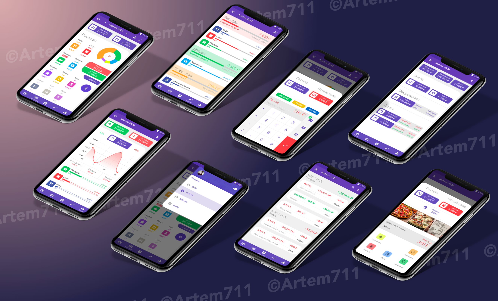
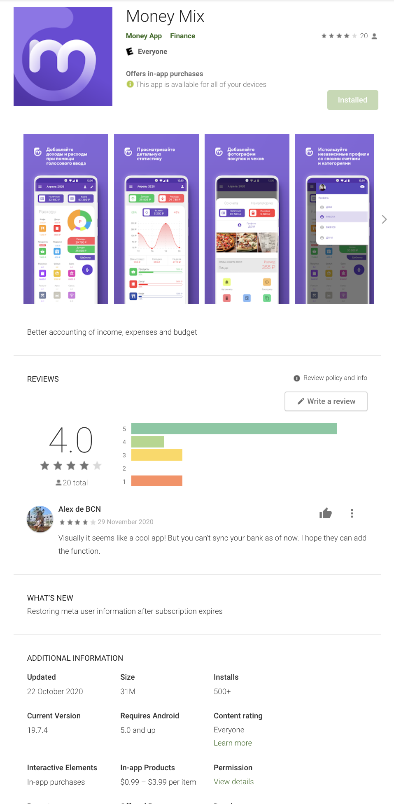

<h1 align="center">MoneyMix</h1>

Financial budgeting app with real-time multi-device synchronization

## Overview

It is built for iOS and Android using React Native using TypeScript programming language.   **Redux** was used as the storage management library.
Main features include:
- [x] XXX

  

 

  
Google Play Submission

  
   
  

    
  

### Folders structure

- `NodeJS-MoneyMix`: backend server for processing real-time data synchronization
- `RN-MoneyMix`: mobile app for financial budgeting

# Authors

> **Artem Moshnin** - Head Full Stack Developer  
> **Email:** swift.uix@gmail.com
